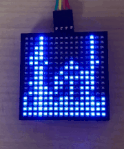
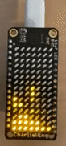
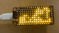
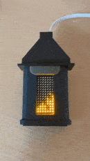
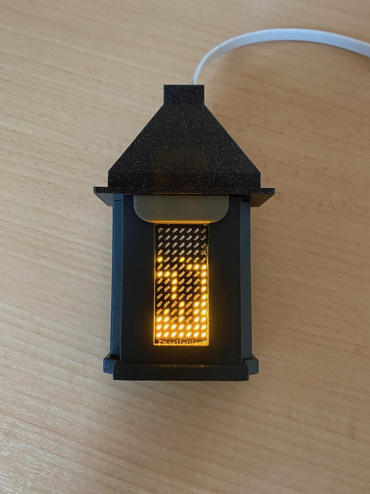
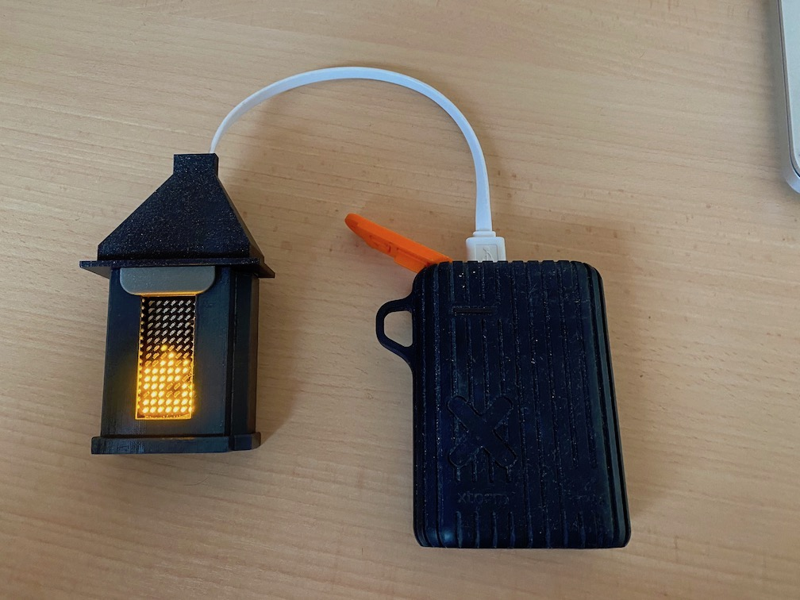

# bitflame

Bitflame has two parts, a simulation written in _python_ `.ipynb` to proof the concept, test and generate _GIFs_. The second part is a `C++` implementation targeting the _Arduino_ platform. It is available as _Arduino Library_ and can be imported into any project. It is a pure software library and can be adapted to any display as demonstrated in the `examples`.

* [Python](./python)
* [C++](./arduino)

## Demo

Some demo _GIFs_ create with the _Python_ notebook and _C++_. You can find all example _GIFs_ in the [media folder](media/examples).

### 16x16 Matrix UART (C++)

From examples. _(My 16x16 matrix has some dead pixels, ignore them ;))_

### GIFs from Simulation (Python)

#### Slow Flames

Standard set of parameters.

#### Fast Flames

More noise flames, look less alive but give a nervous feeling for afar.

#### Different Sizes

Display of variations when changing the height with different parameters.

#### Candles

Small matrices to simulate candles.

#### Large

Some large examples with different parameters.

#### Faded

More detailed and more calculation needed.

***

### Builds

Builds using this library.

#### Fire place

The _C++_ implementation has been used to create a small [Feather](https://www.adafruit.com/feather) powered fire place. The 3D print files are available on [Thingiverse](https://www.thingiverse.com/thing:4698466) together with a list of components used.

[Link to media folder](media/examples/fire-place-build)
